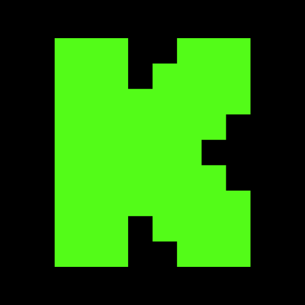

<div align="center">


# ChatYX

**Мультиплатформенный чат-оверлей для OBS: Twitch, YouTube и Kick в одном Browser Source.**

<p>
  
  &nbsp;&nbsp;
  
  &nbsp;&nbsp;
  
</p>

[](https://github.com/Linaryx/ChatYX/actions/workflows/deploy-pages.yml)
[](./package.json)
[](https://bun.sh/)
[](./LICENSE)

### [⚙️ Настроить оверлей](https://chat.ruina.team/) · [🩺 Статус](https://chat.ruina.team/status) · [🛰️ Chat Sources Bridge](./services/youtube-websocket/README.md)

[Возможности](#-возможности) ·
[Быстрый старт](#-быстрый-старт) ·
[Архитектура](#-как-это-работает) ·
[Настройка URL](#-настройка-url) ·
[Команды](#-команды-в-чате) ·
[Разработка](#-разработка) ·
[Self-hosting](#-self-hosting-chat-sources-bridge)

</div>

---

## О проекте

**ChatYX** — open-source оверлей чата для стримов. Он объединяет сообщения с
**Twitch**, **YouTube Live Chat** и **Kick** в одной браузерной сцене OBS,
поддерживает сторонние эмоуты и косметику, события чата, модерацию, гибкое
оформление и управление оверлеем прямо из Twitch-чата.

Frontend статический: Twitch подключается напрямую из Browser Source, а
YouTube и Kick используют отдельный WebSocket bridge. Поэтому основной
интерфейс можно размещать на обычном статическом хостинге, а bridge —
при необходимости поднять самостоятельно.

> Основной сценарий использования не требует ручного редактирования URL:
> откройте [chat.ruina.team](https://chat.ruina.team/), настройте оверлей и
> скопируйте готовую ссылку для OBS.

## ✨ Возможности

### Платформы

- **Twitch** — IRC в реальном времени из браузера, Twitch metadata/GQL,
  moderation events и channel events.
- **YouTube** — Live Chat через Chat Sources Bridge.
- **Kick** — public channel metadata и realtime-подписка через тот же bridge.
- Несколько источников можно использовать одновременно в одном оверлее.

### Эмоуты, бейджи и косметика

- Twitch emotes.
- **7TV**, **BetterTTV** и **FrankerFaceZ**.
- Персональные и zero-width эмоуты.
- Twitch и сторонние бейджи.
- 7TV paints для ников.
- Живые обновления 7TV через EventAPI.
- Cheers / Bits.
- Gigantified emotes и GIF-отображение.

### Сообщения и события

- Replies.
- Highlighted messages.
- Channel Point rewards.
- Twitch channel events.
- Удаление сообщений и moderation events.
- Recent messages при подключении.
- Фильтрация ботов.
- Фильтр одного chatter.
- Поддержка predictions.

### Внешний вид

- Размер текста, шрифт и custom font.
- Отдельный вес ника и основного текста.
- Stroke и shadow.
- Масштаб эмоутов и GIF.
- Fade и анимация сообщений.
- Горизонтальный режим.
- Обратный порядок строк.
- Small caps.
- Перенос после имени.
- Скрытие имён.
- Маркер платформы: `stripe`, `icon` или `none`.
- Настраиваемые фон, прозрачность, радиус, padding и border.
- Отдельное оформление Twitch events.
- Режимы ссылок: обычные, скрытые или выделенные.

### Управление и диагностика

- Команды управления прямо из Twitch-чата.
- Мягкая и полная перезагрузка оверлея.
- Обновление эмоутов, бейджей и косметики без ручной перезагрузки сцены.
- Тестовые сообщения.
- Страница диагностики `/status`.
- Debug/performance monitor через `debug=true`.

### TTS

ChatYX содержит опциональную TTS-подсистему:

- чтение сообщений чата;
- отдельная политика для ботов;
- выбор голоса;
- ограничение длины текста;
- регулировка громкости;
- команды `!tts`;
- `skip`, `stop` и очистка очереди.

TTS не обязателен для работы обычного чат-оверлея. Список голосов и связанные
заметки находятся в [`documents/TTS_VOICES.md`](./documents/TTS_VOICES.md).

## 🚀 Быстрый старт

1. Откройте **[chat.ruina.team](https://chat.ruina.team/)**.
2. Укажите Twitch-канал и, при необходимости, YouTube/Kick.
3. Настройте внешний вид, сообщения, события и дополнительные функции.
4. Скопируйте сгенерированную ссылку оверлея.
5. В OBS добавьте **Browser Source** и вставьте эту ссылку.

Для полноэкранной сцены обычно удобно использовать размер Browser Source,
совпадающий с canvas OBS, например `1920 × 1080`.

Фон самой страницы прозрачный; видимый фон сообщений настраивается отдельно.

## 🧭 Основные маршруты

| Маршрут | Назначение |
|---|---|
| `/` | Страница настройки и live preview |
| `/setup` | Явный alias страницы настройки |
| `/chat` | Сам чат-оверлей для Browser Source |
| `/predictions` | Отдельное представление predictions |
| `/status` | Диагностика frontend и внешних сервисов |

Пример итоговой ссылки:

```text
https://chat.ruina.team/chat?c=examplechannel&yt=example&kick=example&pm=icon
```

Настройщик генерирует URL автоматически, поэтому собирать его вручную обычно
не требуется.

## ⚙️ Как это работает

```text
 Twitch IRC / Twitch GQL ─────────────────────┐
                                              │
 7TV / BTTV / FFZ / IVR APIs ────────────────┼──> ChatYX frontend
                                              │       │
 YouTube Live Chat ─┐                         │       └──> OBS Browser Source
                    ├──> Chat Sources Bridge ─┘
 Kick realtime ─────┘          │
                               └── WebSocket
```

### Twitch

Twitch IRC работает непосредственно в Browser Source. Данные эмоутов, бейджей,
cosmetics и часть metadata загружаются из соответствующих API.

### YouTube и Kick

Отдельный сервис в [`services/youtube-websocket`](./services/youtube-websocket/)
нормализует события YouTube и Kick и отправляет их frontend по WebSocket.

Для YouTube это позволяет не полагаться на прямые browser-запросы к Innertube,
которые могут упираться в CORS и rate limits. Для Kick bridge использует public
channel metadata, временную guest session и realtime transport.

## 🔧 Настройка URL

Источник истины для query-параметров:
[`src/config/chatUrlParams.ts`](./src/config/chatUrlParams.ts).

### Источники чата

| Параметр | Назначение |
|---|---|
| `c` | Twitch channel; alias: `channel` |
| `yt` | YouTube handle / channel |
| `kick` | Kick channel slug |
| `ytws` | URL YouTube WebSocket bridge |
| `kickws` | URL Kick WebSocket bridge |
| `pm` | Platform marker: `none`, `stripe`, `icon` |

Hosted bridge по умолчанию:

```text
wss://ytwss.ruina.team
```

Для локального bridge:

```text
ytws=ws://localhost:9905
kickws=ws://localhost:9905
```

### Основные параметры отображения

| Параметр | Назначение |
|---|---|
| `s` | Размер текста |
| `f` | Пресет шрифта |
| `fw` | Font weight |
| `nfw` | Font weight ника |
| `fc` | Custom font при custom-пресете |
| `sh` | Shadow |
| `st` | Stroke |
| `fd` | Fade в секундах |
| `an` | Режим анимации |
| `ms` | Скорость анимации сообщений |
| `es` | Масштаб эмоутов |
| `gifs` | Показывать GIF |
| `gifscale` | Масштаб GIF |
| `sc` | Small caps |
| `nl` | Перенос после имени |
| `hn` | Скрывать имена |
| `rl` | Reverse line order |
| `hr` | Horizontal layout |

### Сообщения и фильтры

| Параметр | Назначение |
|---|---|
| `rm` | Recent messages |
| `rmlimit` | Лимит recent messages, от `1` до `100` |
| `b` | Показывать сообщения ботов |
| `bn` | Список bot names |
| `cmd` | Отображение command messages |
| `sg` | Показывать одного chatter |
| `u7` | Показывать unlisted 7TV emotes |
| `hsb` | Скрывать сторонние бейджи |

### Контейнер и события

| Параметр | Назначение |
|---|---|
| `bgc` | Цвет фона overlay |
| `bgo` | Прозрачность фона |
| `bgr` | Border radius |
| `bgp` | Padding |
| `bgb` | Прозрачность border |
| `teh` | Highlight Twitch events |
| `tec` | Цвет Twitch events |
| `teo` | Прозрачность фона Twitch events |
| `teb` | Bold для Twitch events |
| `tei` | Italic для Twitch events |
| `hl` | Highlighted messages |
| `rewards` | Channel Point rewards |
| `gigantify` | Gigantified emotes |
| `pred` | Predictions |

### Ссылки

| Параметр | Назначение |
|---|---|
| `links` | `normal`, `hide` или `highlight` |
| `linkcolor` | Цвет выделенных ссылок |
| `hidelinkrewards` | Скрывать link rewards |

### RTE / TTS

| Параметр | Назначение |
|---|---|
| `rtep` | RTE proxy |
| `aztts` | Azure TTS provider |
| `rtetts` | ChatIS TTS provider |
| `rtebadge` | RTE badge integration |
| `rtecosmetics` | RTE custom cosmetics |
| `ttsread` | Читать сообщения чата |
| `ttsbots` | Читать сообщения ботов |
| `ttsvoice` | Голос основного TTS provider |
| `ttschatisvoice` | Голос ChatIS provider |
| `ttsvolume` | Громкость |
| `ttsmax` | Максимальная длина текста |

Boolean-параметры понимают формы:

```text
true / 1 / yes / on
false / 0 / no / off
```

Поддерживаются и legacy aliases. Для генерации и импорта конфигурации лучше
использовать setup-страницу: она применяет нормализацию и валидацию значений.

## 💬 Команды в чате

Команды обрабатываются для Twitch broadcaster, `lead_moderator` и `moderator`.

Основные префиксы равноправны:

```text
!chat
!chatis
!chatyx
```

| Команда | Действие |
|---|---|
| `!chat refresh` | Обновить эмоуты, бейджи и cosmetics |
| `!chat refresh emotes` | Обновить только эмоуты |
| `!chat refresh badges` | Обновить только бейджи |
| `!chat refresh cosmetics` | Обновить cosmetics |
| `!chat reload` | Мягкая перезагрузка runtime |
| `!chat hardreload` | Полная перезагрузка Browser Source |
| `!chat show` | Показать чат |
| `!chat hide` | Скрыть чат |
| `!chat clear` | Очистить сообщения |
| `!chat ping` | Проверить обработку команд |
| `!chat test [1-50]` | Добавить тестовые сообщения |
| `!tts <текст>` | Произнести текст через включённый TTS provider |
| `!tts -v <voice> <текст>` | Произнести текст выбранным голосом |
| `!tts skip` | Пропустить текущую реплику |
| `!tts stop` | Остановить TTS |
| `!tts clear` | Очистить очередь TTS |

Для `refresh` без аргумента используется scope `all`.

Поддерживаются legacy-команды:

```text
!refreshoverlay
!update
!clearcache
!reloadchat
!hardreload
```

### Developer channel targeting

В developer chat `#linaryx` команды от configured developer identity могут
адресоваться конкретному каналу через `-c`:

```text
!chatyx refresh -c channel
!chatyx reload -c channel1,channel2
!chatyx ping -c all
```

## 🧩 DOM-хуки сообщений

Каждая строка чата использует `.chat_line` и содержит стабильные data-атрибуты,
которые можно использовать для собственных CSS/JS, тем и отладки.

| Хук | Где | Содержимое |
|---|---|---|
| `data-platform` | `.chat_line` | `twitch`, `youtube` или `kick` |
| `data-nick` | `.chat_line` | Логин автора |
| `data-user-id` | `.chat_line` | ID автора |
| `data-time` | `.chat_line` | Unix time сообщения в миллисекундах |
| `data-id` | `.chat_line` | ID сообщения |
| `data-event` | `.chat_line` | Тип Twitch event, если есть |
| `.badge` | строка | Бейджи автора |
| `.user_info` | строка | Контейнер информации об авторе |
| `.nick` | строка | Ник |
| `.colon` | строка | Разделитель |
| `.message` | строка | Текст и эмоуты |
| `.emote-container` | `.message` | Обёртка эмоутов |
| `.reply_line` | строка | Превью reply |
| `.mention` | `.message` | Mention |
| `.chat-link` | `.message` | Ссылка |

## 🛠 Разработка

### Требования

- **Bun `>=1.3.14`**
- Git

### Запуск frontend

```bash
git clone https://github.com/Linaryx/ChatYX.git
cd ChatYX

bun install
bun run dev
```

Vite dev server будет доступен на:

```text
http://localhost:5173/
```

### Команды проекта

| Команда | Что делает |
|---|---|
| `bun run dev` | Vite dev server |
| `bun run build` | Production frontend build |
| `bun run build:pages` | Build + подготовка GitHub Pages |
| `bun run start` | Vite preview |
| `bun run sources:dev` | Chat Sources Bridge с `--watch` |
| `bun run sources:start` | Запуск bridge |
| `bun run youtube:dev` | Alias для `sources:dev` |
| `bun run youtube:start` | Alias для `sources:start` |
| `bun run lint` | Lint frontend и bridge |
| `bun run typecheck` | TypeScript checks |
| `bun run test` | Bun tests из `tests/` |
| `bun run check` | Lint + typecheck + tests + frontend build |

Перед PR удобно запускать:

```bash
bun run check
```

## 🛰️ Self-hosting Chat Sources Bridge

Bridge находится в:

```text
services/youtube-websocket/
```

Несмотря на имя директории, сервис обслуживает **YouTube и Kick**.

### Локальный запуск

```bash
bun install
bun run sources:dev
```

Порт по умолчанию:

```text
9905
```

### Endpoints

```text
ws://localhost:9905/sources/youtube/channels/<handle-or-channel-id>
ws://localhost:9905/sources/kick/channels/<channel-slug>

# Legacy YouTube routes:
ws://localhost:9905/c/<handle-or-channel-id>
ws://localhost:9905/s/<video-id>

# Health:
http://localhost:9905/health
```

`/health` возвращает:

```text
ok
```

### Переменные окружения bridge

| Переменная | Назначение |
|---|---|
| `HOST` | Host Bun server |
| `PORT` | Порт bridge |
| `YOUTUBE_PROXY_URL` | Необязательный proxy для YouTube requests |

Пример:

```bash
YOUTUBE_PROXY_URL=http://proxy.example:1080 bun run sources:start
```

### Docker

```bash
docker build \
  -f services/youtube-websocket/Dockerfile \
  -t chatyx-youtube-websocket .

docker run -d \
  --name chatyx-youtube-websocket \
  --restart unless-stopped \
  -p 9905:9905 \
  chatyx-youtube-websocket
```

С proxy:

```bash
docker run -d \
  --name chatyx-youtube-websocket \
  --restart unless-stopped \
  -p 9905:9905 \
  -e YOUTUBE_PROXY_URL=http://proxy.example:1080 \
  chatyx-youtube-websocket
```

Для production нужен TLS-capable reverse proxy, чтобы Browser Source мог
подключаться по `wss://`.

## 🌐 Frontend environment

Поддерживаются необязательные build-time переменные:

```env
# Backend для функций, которым нужен отдельный API
VITE_API_URL=https://api.example.com

# Переопределение Twitch web GraphQL Client-ID
VITE_TWITCH_GQL_CLIENT_ID=your-client-id
```

В production backend используется только если `VITE_API_URL` задан явно.

## 🗂️ Структура проекта

```text
ChatYX/
├── .github/workflows/          # CI / GitHub Pages
├── documents/                  # Design, licensing, references, TTS docs
├── public/                     # Static assets and platform icons
├── scripts/                    # Build/deploy helpers
├── services/
│   └── youtube-websocket/      # YouTube + Kick WebSocket bridge
├── src/
│   ├── components/             # UI components
│   ├── config/                 # Chat config and URL parameters
│   ├── routes/                 # setup, chat, status, predictions...
│   ├── services/
│   │   ├── badges/
│   │   ├── chat/
│   │   ├── diagnostics/
│   │   ├── network/
│   │   └── predictions/
│   ├── styles/
│   ├── types/
│   └── utils/
├── tests/
├── package.json
├── bun.lock
└── vite.config.ts
```

## ✅ CI и деплой

GitHub Actions workflow
[`.github/workflows/deploy-pages.yml`](./.github/workflows/deploy-pages.yml)
запускается для pull requests и push в `main`/`master`.

Build job выполняет:

1. `bun install --frozen-lockfile`
2. lint
3. typecheck
4. tests
5. GitHub Pages build
6. Docker build Chat Sources Bridge

Для pull request выполняются проверки без deploy. Для push workflow после
успешного build публикует `dist/` через GitHub Pages.

## 🩺 Состояние сервисов

- Frontend / setup: **https://chat.ruina.team/**
- Диагностика: **https://chat.ruina.team/status**
- Hosted Chat Sources Bridge: **https://ytwss.ruina.team**
- Health endpoint: **https://ytwss.ruina.team/health**

Внешние API и realtime-сервисы остаются отдельными зависимостями и могут иметь
собственные ограничения или периоды недоступности.

## 📚 Документация

| Документ | Содержание |
|---|---|
| [`documents/DESIGN.md`](./documents/DESIGN.md) | Design notes проекта |
| [`documents/CHAT_REFERENCES.md`](./documents/CHAT_REFERENCES.md) | Reference/provenance notes |
| [`documents/TTS_VOICES.md`](./documents/TTS_VOICES.md) | TTS voices |
| [`documents/LICENSING.md`](./documents/LICENSING.md) | Подробная политика лицензирования |
| [`services/youtube-websocket/README.md`](./services/youtube-websocket/README.md) | Chat Sources Bridge |

## 🧱 Стек

<p align="center">
  <a href="https://www.solidjs.com/"></a>
  <a href="https://www.typescriptlang.org/"></a>
  <a href="https://vite.dev/"></a>
  <a href="https://bun.sh/"></a>
  <a href="https://www.docker.com/"></a>
</p>

| Слой | Технологии |
|---|---|
| Frontend | SolidJS, TypeScript, Vite |
| UI | Tailwind CSS, Kobalte, Lucide |
| Runtime | Bun |
| Chat bridge | Bun WebSocket server, YouTube.js, Kick realtime |
| Интеграции | Twitch IRC/GQL, 7TV, BetterTTV, FrankerFaceZ, IVR |
| Quality | Oxlint, TypeScript, Bun Test, GitHub Actions |
| Packaging | GitHub Pages, Docker |

## 🤝 Изменения и pull requests

Для изменений в проекте:

```bash
git checkout -b feature/my-change
bun install
bun run check
```

После этого откройте pull request с кратким описанием изменения и способом
проверки.

Если изменение затрагивает сторонний код, ассеты или лицензирование, сверяйтесь
с [`documents/LICENSING.md`](./documents/LICENSING.md) и сохраняйте необходимые
upstream notices.

## 📄 Лицензия

Текущий first-party код ChatYX распространяется под
**GNU General Public License v3.0 only (`GPL-3.0-only`)**.

Полный текст: [`LICENSE`](./LICENSE).

Исторический MIT notice и текст лицензии для ранее опубликованного материала
сохранены в [`LICENSE-MIT`](./LICENSE-MIT). Подробности перехода и требования к
атрибуции описаны в [`documents/LICENSING.md`](./documents/LICENSING.md).

---

<div align="center">

**ChatYX** · Twitch + YouTube + Kick · built for OBS Browser Source

[Настроить](https://chat.ruina.team/) ·
[Статус](https://chat.ruina.team/status) ·
[Исходный код](https://github.com/Linaryx/ChatYX)

</div>
